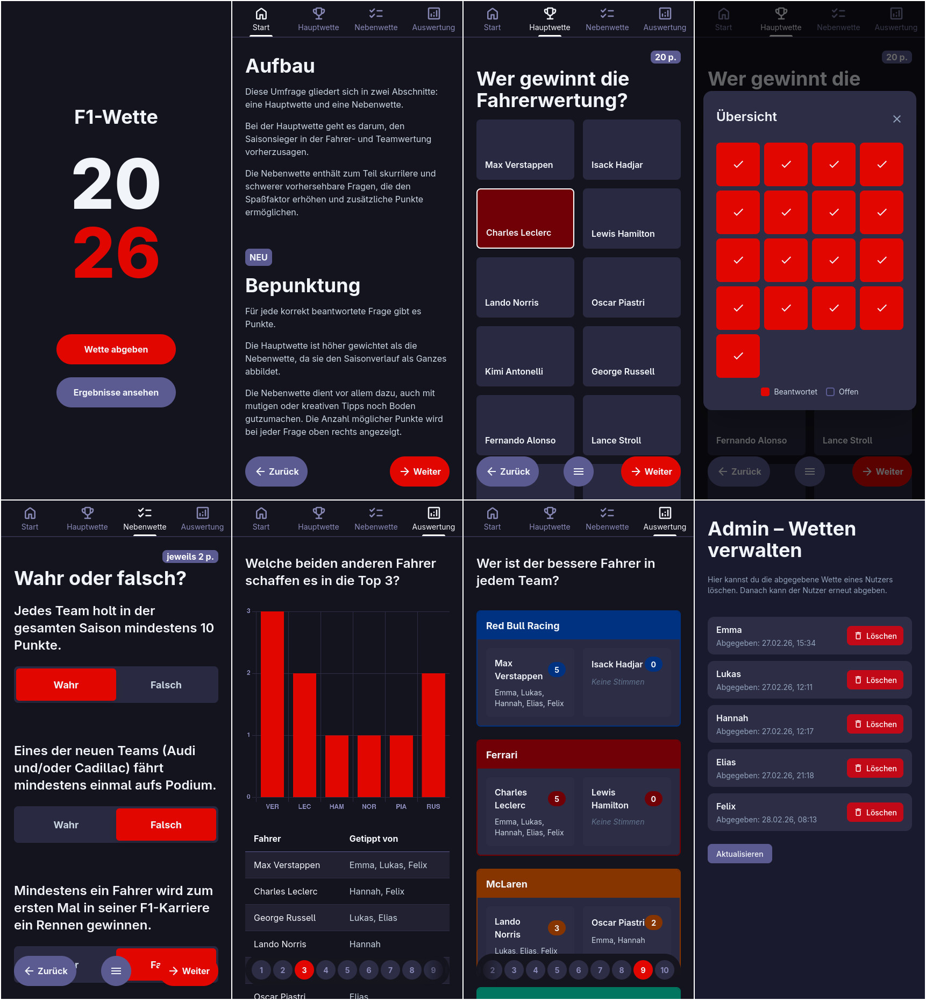

# F1 Bet

A web app for placing and managing Formula 1 season bets. Users can submit **main bets** (e.g. top 3 drivers/teams), **side bets** (race-by-race predictions), and **statement bets**, then view results and rankings.

## Features

- **Main bet** – Predict top 3 drivers and top 3 teams for the season (2 steps)
- **Side bet** – Multi-step predictions across 8 steps (drivers, teams, statements)
- **Results** – View all submitted bets and 10 result/evaluation views (Auswertung 1–10)
- **Admin** – Delete bets by user name
- **API** – REST backend to submit, list, and delete bets; data persisted in a JSON file

## Tech Stack

| Part      | Stack |
|----------|--------|
| Frontend | Vue 3, Vue Router, Pinia, Vite, TypeScript, Tailwind CSS, Chart.js |
| Backend  | Node.js, Express, TypeScript |
| Data     | JSON file (`data/bets.json`) |
| Deploy   | Docker Compose, Kubernetes manifests, GitHub Actions (Docker build) |

## Quick Start

### With Docker Compose

```bash
git clone https://github.com/Fabinatix97/f1-bet.git
cd f1-bet
docker compose up --build
```

- **Frontend:** http://localhost:8080  
- **Backend API:** http://localhost:3000  

Bets are stored in a Docker volume; the backend writes to `/app/data/bets.json` inside the container.

### Local development

**Backend**

```bash
cd backend
npm install
npm run dev
```

Runs at http://localhost:3000. Uses `./data/bets.json` (created automatically).

**Frontend**

```bash
cd frontend
npm install
npm run dev
```

Runs at http://localhost:5173. To use the local backend, set:

```bash
VITE_API_BASE_URL=http://localhost:3000/api
```

Then reload the app so it calls the backend instead of the same origin.

**Node versions**

- Backend: Node ≥ 18  
- Frontend: Node ^20.19.0 or ≥ 22.12.0  

## Project structure

```
f1-bet/
├── frontend/          # Vue 3 + Vite SPA
│   ├── src/
│   │   ├── views/     # Intro, Explanation, UserInfo, MainBet, SideBet, Results, Admin
│   │   ├── components/
│   │   ├── stores/    # Pinia (bet, snackbar)
│   │   ├── services/  # betApi.ts
│   │   └── router/
│   └── Containerfile
├── backend/           # Express API
│   ├── src/
│   │   ├── routes/    # /api/bets
│   │   ├── store/     # betStore (JSON file)
│   │   └── types/
│   └── Containerfile
├── .kubernetes/       # K8s deployments and services
├── .github/workflows/ # Docker image build on push/PR to main
└── docker-compose.yaml
```

## API

| Method | Path | Description |
|--------|------|-------------|
| `GET`  | `/api/health` | Health check |
| `GET`  | `/api/bets`   | List all bets |
| `POST` | `/api/bets`   | Submit or update a bet (body: `BetData`) |
| `DELETE` | `/api/bets/:userName` | Delete a user's bet |

## Screenshots


